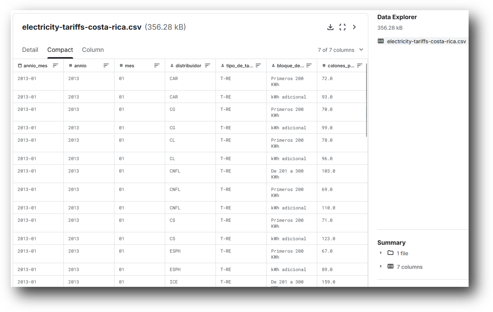
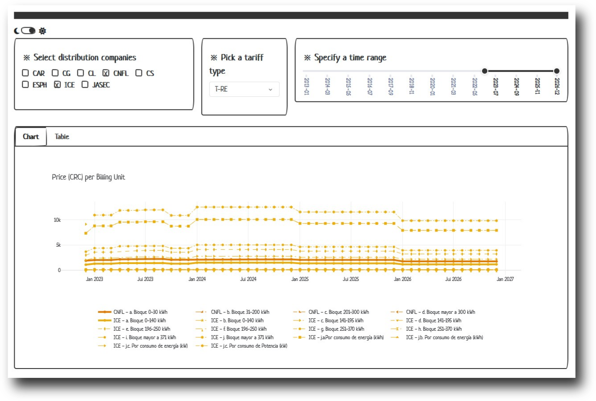

# Electricity Tariffs Costa Rica

[ARASEP](https://en.wikipedia.org/wiki/Autoridad_Reguladora_de_Servicios_P%C3%BAblicos), the regularity institution of Costa Rica's energy prices,  publishes historical records and charts on the country's electricity pricing. Although said data is of relative good quality, it is also somewhat difficult to work with when using open-source analytics tooling:

- **Proprietary format:** Published as an Excel workbook
- **Non-standard structure:** Data from each distribution company spreads across multiple worksheets. Furthermore, tariff data is framed within tables of variable column count (i.e. months as columns/metrics)
- **Buggy and region-locked visualization:** As of June 2026, the PowerBI visualizations embedded on the [ARASEP's website](https://aresep.go.cr/electricidad/tarifas/) does not properly reflect average tariff prices per distribution company or across years. The site appears to be also reachable only form national IP addresses.

This repository includes tooling is used to create/update/visualize the ["Electricity Tariffs Costa Rica" Kaggle Dataset](https://www.kaggle.com/datasets/slothkong/electricity-tariffs-costa-rica), in an attempt to address the aforementioned challenges.

## Features 

### Modeling

Enables data [processing](./processing) subroutines to transform the source data into a more convenient data structure.

### Visualization
Provides a working [dashboard](./dashboard/) of top of the clean data via a [Dash](https://dash.plotly.com/) app:

## Contributing

Contributions are welcome. See the [repository's issues page](https://github.com/slothkong/electricity-tariffs-costa-rica/issues) to report problems or share ideas/improvements.