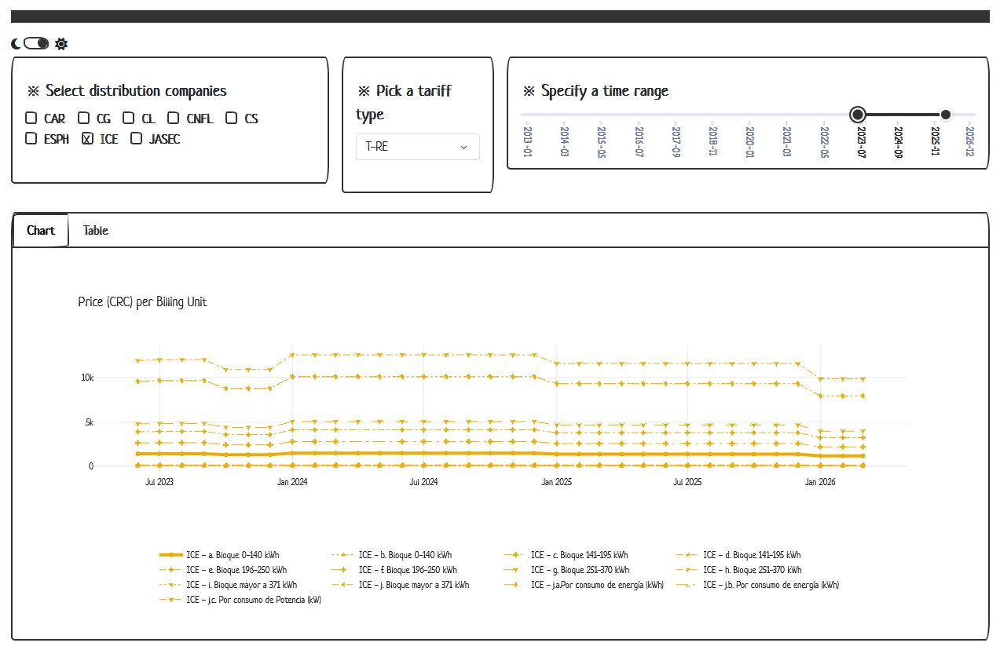

# Demo Dashboard

A demo [Dash](https://dash.plotly.com/) application to visualize the [Electricity Tariffs Costa Rica Kaggle Dataset](https://www.kaggle.com/datasets/slothkong/electricity-tariffs-costa-rica).



## Before You Begin

Make sure the data file is available within your local file system, at the path:
> `../../kaggle/input/datasets/slothkong/electricity-tariffs-costa-rica/electricity-tariffs-costa-rica.csv`.

## Usage

Install the required `python` libraries:
```bash
pip install -r requirements.txt
```

Change to the source code directory:
```bash
cd app/
```

Start the application:
```bash
python app.py
```

Explore the dataset interactively by pointing your browser to:
```
127.0.0.1:8050
```
